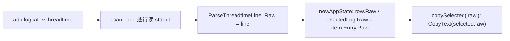

## 问题与范围

排查“详情面板点复制原文后，拿到的文本本身已经不完整”是否由仓库内代码截断，还是 Android/logcat 源头限制。

## 速答

结论：当前仓库内链路不会主动把 `raw` 截成半截，`复制原文` 复制的是 `adb logcat` 读到的整行原文；这次截断更像 Android 日志单条 payload 上限导致的**源头截断**，不是前端详情面板或复制逻辑再截了一次。

## 关键证据

1. `复制原文` 直接复制 `selected.raw`，没有二次格式化或裁剪：`frontend/src/use-app-controller.ts:120-126`。
2. Wails 状态映射把 `item.Entry.Raw` 原样写进列表行和详情选中项：`app_state.go:174-189`。
3. 解析器保留原始整行，`Raw` 字段直接等于传入的 `line`：`internal/logcat/parser.go:37-48`。
4. `logcat` 采集层只是从 `adb logcat -v threadtime` 的 stdout 逐行读取并透传，没有自定义长度裁剪：`internal/adb/logcat_source.go:61-76`。
5. 新增测试已把“长 raw 在仓库内链路中原样保留”钉住：`internal/logcat/parser_test.go`、`app_state_test.go`。

## 细节展开

前端复制链路很短：按钮触发 `copySelected("raw")`，它只取 `state.selectedLog.raw` 并调用 `CopyText`。因此只要 `raw` 已经是半截，问题一定发生在复制之前。

后端状态映射也没有做任何 `substring`、`slice`、`ellipsis` 或按长度截断。`newAppState` 直接把 `item.Entry.Raw` 复制到 `row.Raw`，若当前行被选中，再复制到 `SelectedLog.Raw`。

再往前追到解析层，`ParseThreadtimeLine` 虽然会拆 `message` 和 `source`，但 `Raw` 字段始终是原始输入 `line`。所以只要 `raw` 被截断，说明进入解析器前拿到的那一行就已经不完整了。

仓库里唯一和“长行”有关的实现细节是 `bufio.Scanner`。它在这里承担“逐行取 stdout”的职责，但当前现象不像 scanner 超限：超限会报错并中断流，而不是安静地给出一条语义完整但尾巴被削掉的 `raw`。结合用户样例在长 URL / `X-Amz-*` 参数中部收尾，更符合 Android/logcat 单条日志 payload 上限。

Android AOSP 源码里 `LOGGER_ENTRY_MAX_PAYLOAD` 明确限制单条日志 payload 上限，超过会被截断；因此只要上游（例如 Chromium console 输出）把整段 JSON 当成一条日志写入，这条日志就可能在进入 `adb logcat` 之前已经丢尾巴。

## 未决问题

是否要在 UI 上对“疑似被系统截断的日志”做显式提示，当前还没拍板。

## 后续建议

若要继续处理这个现象，下一步应先决定是做“显式提示系统截断”，还是改用不依赖 logcat 单条 payload 上限的采集通道。

## 相关文档

- `.codestable/compound/2026-06-10-explore-message-highlight-whitespace-loss.md`
- `.codestable/issues/2026-06-10-detail-json-fragment-split/detail-json-fragment-split-fix-note.md`
