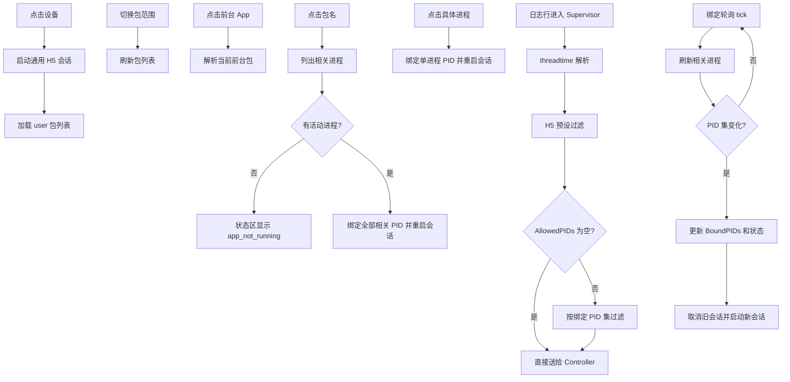

# package-pid-and-process-sync design

## 0. 术语约定

| 术语 | 定义 | 防冲突结论 |
| --- | --- | --- |
| 包范围 | 包列表加载时使用的范围：`user` / `system` / `all` | 直接复用 roadmap 第 4.1 节的 `PackageScope` |
| 包列表快照 | 当前设备在指定包范围下返回的包名列表 | 直接复用 roadmap 第 4.1 节的 `PackageInfo` |
| 进程快照 | 当前包关联的运行进程集合，包含 `PID` 与 `processName` | 直接复用 roadmap 第 4.1 节的 `ProcessInfo` |
| 会话绑定 | 当前日志会话绑定的 `device + package + process + active PIDs` 组合 | 当前代码和架构里无同名概念，可安全引入 |
| PID 重绑 | 选中包或进程的活动 PID 集变化后，取消旧会话并用新 PID 集重启会话 | 当前代码和架构里无同名概念，可安全引入 |

## 1. 决策与约束

### 需求摘要

- **做什么**：在现有单设备 H5 日志查看链路上，补齐包名选择、前台应用一键选择、进程/PID 绑定，以及 App 重启后的自动重绑。
- **为谁做**：已经能看 `chromium + [H5]` 日志、但还不知道宿主包名，或需要把日志收窄到具体 App / 具体进程的 H5 调试者。
- **成功标准**：
  - 选中设备后能加载用户 App 列表，并允许切到系统 / 全部范围；
  - “前台 App”动作能把当前前台包切成选中包；
  - 选中包后会解析出相关进程，默认绑定到该包的全部相关 PID；
  - 选中具体进程后，主列表只显示该进程 PID 的 H5 日志；
  - 目标包未运行时状态区显式提示，不沿用旧绑定假装成功；
  - App 重启或进程 PID 变化后，当前会话会自动重绑并给出可见状态文案。
- **明确不做**：
  - 不解析 App label、图标、版本号或 APK 元数据；
  - 不实现多包同时绑定或多进程并行查看；
  - 不做持续前台 App 自动跟随，只提供显式“一键选择前台 App”动作；
  - 不把当前 `chromium + [H5]` 预设扩成通用全量 Logcat 查看器；
  - 不在本 feature 里做 `adb logcat --pid` 能力探测和命令层优化，当前先以本地 PID 过滤满足用户行为。

### 复杂度档位

走桌面内部工具默认档位，无偏离。

### 关键决策

1. **包名 / 前台包 / 进程发现继续放在 `adb.Service`**
   - 所有 adb 命令和文本解析仍由 `internal/adb` 封装，UI 和 controller 不拼 shell 管道，不依赖 `findstr` 之类主机命令。
2. **会话绑定由 controller 维护，PID 重绑通过“停旧会话 + 起新会话”实现**
   - 当前架构的会话入口已经集中在 `Controller.SelectDevice`，复用这一层做包/进程切换和 PID 重绑，避免把长期轮询塞进 `session.Supervisor`。
3. **PID 过滤先在 session/app 层本地执行**
   - 继续保留当前 `chromium + [H5]` 命令层预设，解析后再按绑定 PID 集过滤，先满足行为正确性，再把 `--pid` 作为后续性能优化点。
4. **UI 继续沿用当前按钮列表模式，不引入自定义下拉组件**
   - 当前 Gio 壳已经有设备按钮、控制按钮和滚动列表；包和进程同样落成滚动按钮列表，避免本 feature 先造一套复杂选择器。
5. **前台 App 选择是显式动作，不做持续自动切换**
   - 用户点击时读取当前前台包并切换一次，之后仍由用户决定是否继续锁定这个包，避免前台变化把当前调试上下文悄悄带跑。

## 2. 名词与编排

### 2.1 名词层

#### 现状

- 当前 `adb.Service` 只有 `DetectADB` 和 `ListDevices`，没有包、前台应用或进程发现能力。来源：[service.go](/E:/github/logcat/internal/adb/service.go:8)
- 当前 `session.Config` 只有 `DeviceID`，不能表达包名、进程或 PID 绑定。来源：[supervisor.go](/E:/github/logcat/internal/session/supervisor.go:9)
- 当前 `app.Model` 只有设备、日志、搜索、暂停和选中态，没有包范围、包列表、进程列表或绑定 PID。来源：[model.go](/E:/github/logcat/internal/app/model.go:28)
- 当前 `ui.Shell` 左侧只有设备区，用户无法在界面里选择包或进程。来源：[devices_panel.go](/E:/github/logcat/internal/ui/devices_panel.go:13)

#### 变化

1. **补齐 roadmap 合同里的 `PackageScope`、`PackageInfo`、`ProcessInfo`**
   - `internal/adb` 新增包范围枚举、包列表项和进程项，让后续 UI / controller 不直接处理原始 adb 文本。
2. **新增 `SessionBinding`**
   - 在 `app` 层显式保存当前绑定的 `device / package / process / active PIDs`，供状态展示、重绑比较和会话重启复用。
3. **扩展 `session.Config`**
   - 增加 `AllowedPIDs`、`PackageName`、`ProcessName`，让当前会话知道自己绑定的是哪一组 PID。
4. **扩展 `app.Model`**
   - 增加 `PackageScope`、`Packages`、`SelectedPackage`、`Processes`、`SelectedProcess`、`BoundPIDs`，把“当前在看哪个 App / 进程”变成 UI 可观察状态。
5. **补齐 controller 操作面**
   - 新增 `SetPackageScope`、`RefreshPackages`、`SelectForegroundPackage`、`SelectPackage`、`SelectProcess`，并补设备切换时的绑定清理与 watcher 取消。

#### 接口示例

```go
packages, err := service.ListPackages(ctx, "device-1", adb.PackageScopeUser)
// 返回当前设备的用户包列表，MVP 只要求包名
```

```go
pkg, err := service.CurrentForegroundPackage(ctx, "device-1")
// 返回当前前台包名，例如 com.xxx.host
```

```go
processes, err := service.ListProcesses(ctx, "device-1", "com.xxx.host")
// 返回主进程、:webview、:remote 这类当前正在跑的进程快照
```

```go
controller.SelectPackage(ctx, "com.xxx.host")
model := controller.Model()
// model.SelectedPackage == "com.xxx.host"
// model.Processes 保存该包相关进程
// model.BoundPIDs 保存当前会话使用的 PID 集
```

### 2.2 编排层



#### 现状

- 设备点击后 controller 直接起一个不带包 / PID 约束的 H5 会话。来源：[controller.go](/E:/github/logcat/internal/app/controller.go:59)
- `session.Supervisor` 当前只做“解析 threadtime + 过滤 `[H5]`”，没有二次 PID 过滤。来源：[supervisor.go](/E:/github/logcat/internal/session/supervisor.go:42)
- UI 左侧只有设备列表，没有第二层选择上下文。来源：[devices_panel.go](/E:/github/logcat/internal/ui/devices_panel.go:13)

#### 变化

1. 设备点击后仍保留“通用 H5 会话”作为默认起点，但会同步加载 `user` 包范围列表。
2. 包范围切换和前台 App 选择只影响左侧包列表 / 当前绑定，不隐式切设备。
3. 选中包后，controller 先解析相关进程，再按“全部相关进程”启动绑定会话；选中具体进程后改为只绑定该进程 PID。
4. `session.Supervisor` 在现有 H5 预设之后新增一层“AllowedPIDs 命中判断”，把不属于当前绑定 PID 集的条目挡掉。
5. controller 启动一个包级轮询 watcher；发现 PID 集变化时，先更新状态，再取消旧会话并以新 PID 集重启，保持当前设备 / 包 / 进程选择不变。

#### 流程级约束

- **无包选择时**：继续维持当前“设备级 H5 视图”，不因为包列表存在就强制收窄。
- **选中包或进程时**：必须清掉当前可见日志和暂停缓冲，避免把旧绑定的日志混进新上下文。
- **目标包未运行时**：状态区必须显式显示 `app_not_running`，并停止沿用旧 PID 集继续输出。
- **进程相关性规则**：只把 `processName == packageName` 或 `strings.HasPrefix(processName, packageName + ":")` 的进程视为该包相关进程。
- **PID 重绑顺序**：先取消旧 watcher / 旧会话，再启动新 watcher / 新会话，避免同一设备上并发两个活跃读取。
- **切换设备时**：包范围、选中包、进程列表、选中进程和 BoundPIDs 全部重置到默认状态。

### 2.3 挂载点清单

- `internal/adb`：新增包列表、前台包、进程发现命令与解析
- `internal/session`：扩展 `Config`，在现有 H5 预设之后追加 PID 过滤
- `internal/app`：新增会话绑定状态、包/进程选择编排和 PID 轮询重绑
- `internal/ui`：左侧新增包范围、前台 App、包列表和进程列表入口
- `cmd/logcatviewer/main.go`：依赖装配继续复用同一个 `adb.Service`，不新增新外部依赖

### 2.4 推进策略

1. **微重构：拆开 `internal/adb/service.go` 的职责**
   - 退出信号：设备检测 / 设备列表逻辑搬到独立文件，现有测试仍绿
2. **ADB 包名 / 前台 / 进程发现骨架**
   - 退出信号：`PackageScope`、`ListPackages`、`CurrentForegroundPackage`、`ListProcesses` 均可由纯单测驱动
3. **会话绑定与本地 PID 过滤**
   - 退出信号：`session.Config`、PID 过滤和 controller 绑定状态能通过单测验证“设备级 / 包级 / 进程级”三种模式
4. **UI 包 / 进程选择面板**
   - 退出信号：界面可选择包范围、前台包、包名、进程，并驱动 controller 重启绑定会话
5. **PID 重绑与全量验证**
   - 退出信号：包重启导致 PID 变化时能自动重绑并更新状态；`go test ./...`、`go build ./cmd/logcatviewer` 通过

### 2.5 结构健康度与微重构

#### 评估

- 文件级 — [service.go](/E:/github/logcat/internal/adb/service.go:1)：当前只承载 `DetectADB` 与 `ListDevices`。继续把包列表、前台包、进程解析全部塞进同一文件，会把 `device / package / process` 三类 adb 责任混成一个解析大文件。
- 文件级 — [controller.go](/E:/github/logcat/internal/app/controller.go:1)：当前只负责设备加载和会话切换。新的包/进程绑定行为可以放进新文件承载，不需要先搬旧代码。
- 目录级 — `internal/adb/`：当前目录文件数不多，但职责已经自然分成 `exec`、`logcat source`、`service` 三块；继续加新文件比继续摊平一个 `service.go` 更健康。
- 目录级 — `internal/ui/`：已经拆成 `devices / controls / logs / detail / interactions` 多文件，可继续新增 `package_process_panel` 类似职责文件，不需要重组目录。

#### 结论：微重构（拆文件）

#### 方案

- 搬什么：把现有 `service.go` 按职责拆成 `service.go`（类型和构造）、`device_service.go`（ADB 检测与设备列表）、后续新增 `package_service.go` / `process_service.go`（包与进程发现）。
- 搬到哪：全部仍在 `internal/adb/` 包下，不改 `NewService` 对外签名。
- 行为不变怎么验证：拆分完成后现有 `internal/adb` 测试和 `go test ./...` 继续通过。
- 步骤序列（provable refactor）：
  1. 先把现有检测 / 设备列表逻辑拆出独立文件，保持对外签名不变。
  2. 编译与测试确认零行为改动。
  3. 再在同目录增加包 / 前台 / 进程发现能力。

## 3. 验收契约

1. **设备选中后出现用户包列表**
   - 输入 / 触发：选择一台 `device` 状态设备
   - 期望可观察结果：左侧能看到用户包列表，默认仍保留设备级 H5 会话
2. **前台 App 一键选择**
   - 输入 / 触发：点击“前台 App”
   - 期望可观察结果：当前前台包被选中，进程列表刷新，主列表切到该包绑定上下文
3. **未运行 App 显式阻断**
   - 输入 / 触发：点击一个当前没有进程的包
   - 期望可观察结果：状态区显示 `app_not_running`，旧绑定不再继续输出
4. **包级绑定**
   - 输入 / 触发：点击一个有多个相关进程的包
   - 期望可观察结果：默认绑定该包全部相关 PID，只有这些 PID 的 H5 日志进入主列表
5. **进程级绑定**
   - 输入 / 触发：点击某个具体进程
   - 期望可观察结果：主列表只保留该进程 PID 的 H5 日志
6. **PID 重绑**
   - 输入 / 触发：目标 App 崩溃或重启导致 PID 变化
   - 期望可观察结果：状态区显示 PID 重绑提示，后续日志继续从新 PID 流入
7. **设备切换清理上下文**
   - 输入 / 触发：切换到另一台设备
   - 期望可观察结果：包 / 进程 / BoundPIDs 全部重置，不残留旧设备绑定

### 明确不做的反向核对项

- 代码中不应出现 App label / 图标解析
- 代码中不应出现多包同时绑定或多进程并行会话容器
- 代码中不应出现持续自动前台跟随循环
- 代码中不应把当前 H5 视图扩成非 `chromium + [H5]` 的全量 Logcat 视图

## 4. 与项目级架构文档的关系

本 feature 验收后，需要把以下内容提炼回 architecture：

- **名词**：`PackageScope`、`PackageInfo`、`ProcessInfo`、`SessionBinding`
- **动词骨架**：设备选择后加载包列表；包/进程选择后按 PID 重启绑定会话；PID 变化后自动重绑
- **流程级约束**：设备级 H5 视图是默认态、包未运行显式阻断、PID 过滤先本地执行、切设备必须清绑定

预计主要更新 [runtime-single-device-logcat-loop.md](/E:/github/logcat/.codestable/architecture/runtime-single-device-logcat-loop.md:1) 和 [ARCHITECTURE.md](/E:/github/logcat/.codestable/architecture/ARCHITECTURE.md:1)。
