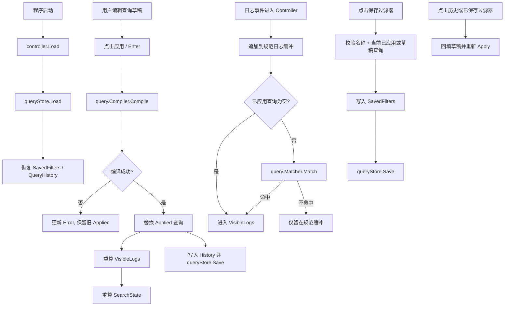

# query-language-and-saved-filters design

## 0. 术语约定

| 术语 | 定义 | 防冲突结论 |
| --- | --- | --- |
| 过滤查询 | 作用在会话日志流上的结构化查询表达式，与当前 `SearchState` 的“搜索当前视图”分离 | 当前代码只有 `SearchState`，没有同名概念，可安全引入 |
| 查询草稿 | 用户正在编辑、但尚未成功应用的原始查询字符串 | 当前代码无同名概念，可安全引入 |
| 已应用查询 | 已编译成功并正在影响 `VisibleLogs` 的查询 | 复用 roadmap 第 4.3 节 `CompiledQuery` 概念 |
| 查询项 | 编译后用于匹配的单个结构化 token / 子表达式单元 | 复用 roadmap 第 4.3 节 `QueryTerm` 叫法 |
| 保存过滤器 | 用户命名并持久化保存的查询配置 | 复用 roadmap 第 4.4 节 `SavedFilter` |
| 查询历史 | 最近成功应用过的查询字符串列表，按时间倒序保留并去重 | 复用 roadmap 第 4.4 节 `QueryHistory` |

## 1. 决策与约束

### 需求摘要

- **做什么**：在现有单设备 H5 查看链路上加入 Android Studio 风格查询语言，以及最小可用的保存过滤器和查询历史。
- **为谁做**：已经能看 `chromium + [H5]` 日志、并能按包/进程收窄上下文，但还需要按 `level/tag/message/age/regex` 等条件进一步精确筛查的调试者。
- **成功标准**：
  - 顶部出现独立的查询输入区，能显式应用/清空查询，不替代当前“搜索当前视图”；
  - 支持 `level:`、`tag:`、`message:`、`age:`、`~` 正则、`-` 否定、`&`、`|`、`()`；
  - 应用查询后，当前已缓存日志与后续新到日志都会按同一查询规则过滤；
  - 查询编译失败时显式显示错误，不假装成空结果，也不静默丢掉上一条有效查询；
  - 保存过滤器和查询历史会落本地文件，重启后仍能恢复；
  - 当前已有的包/进程绑定和“搜索当前视图”能力继续工作，不被新查询平面覆盖。
- **明确不做**：
  - 不做多 Tab / 多查询并行；当前仍只有单活跃会话；
  - 不做完整工作区、导出、团队共享过滤器、颜色/快捷键/pinned 等高级过滤器元数据；
  - 不新增设备端或命令层过滤，不探测 `adb logcat --pid`、不做 buffer 多选；
  - 不把当前 `SearchState` 扩成大小写敏感 / 全词 / 正则搜索；它继续只是“搜索当前视图”；
  - 不实现 `package:` / `process:` 语义查询，因为当前 `LogEntry` 还没有可靠的逐条包名 / 进程名来源，这部分留给后续 richer parsing feature。

### 复杂度档位

走桌面内部工具默认档位，无偏离。

### 关键决策

1. **查询语言与当前视图搜索分成两条状态平面**
   - 查询语言属于会话级过滤，决定哪些日志能进入 `VisibleLogs`；当前 `SearchState` 继续只在 `VisibleLogs` 内做定位，不互相覆盖。
2. **查询采用“显式应用”而不是“边输入边编译”**
   - 用户按 Enter 或点击“应用查询”时才编译；如果新草稿非法，就显示错误并保留上一条已应用查询，避免输入半截表达式时把主列表抖成一片空白。
3. **查询编译和匹配独立成 `internal/query`**
   - `app.Controller` 不自己做 token 解析，避免把会话编排和语法实现搅在一起；匹配规则后续还能复用到 saved filter、导出或多会话。
4. **最小持久化直接种到 `internal/storage`，但只做 filters/history 子集**
   - 当前先落地 `SavedFilters + QueryHistory` 文件存取；完整 workspace/settings/export 继续留在后续 `export-workspace-and-settings`。
5. **保留一份“全部已收日志”的规范缓冲，再派生 `VisibleLogs`**
   - 现有 controller 只有 `VisibleLogs`，无法在查询变化时回放重算；本 feature 需要一份规范日志缓冲作为重过滤源。

## 2. 名词与编排

### 2.1 名词层

#### 现状

- 当前 `SearchState` 只承载“搜索当前视图”的子串定位，不是结构化查询语言。来源：[model.go](/E:/github/logcat/internal/app/model.go:1)、[logview.go](/E:/github/logcat/internal/app/logview.go:1)
- 当前 controller 直接把进入的日志追加到 `VisibleLogs`，没有“全部已收日志 -> 过滤后可见日志”的双层缓冲。来源：[logview.go](/E:/github/logcat/internal/app/logview.go:1)
- 当前 UI 顶部只有 `搜索当前视图` 输入框，没有独立查询编辑区、保存过滤器区或历史区。来源：[controls_panel.go](/E:/github/logcat/internal/ui/controls_panel.go:1)
- 当前仓库没有 `internal/query`、`internal/storage` 之类的查询语法或持久化模块。来源：`Get-ChildItem -Recurse -File internal`

#### 变化

1. **新增 `internal/query`**
   - 定义 `CompiledQuery`、`QueryTerm`、`QueryCompiler`、`QueryMatcher` 和查询编译错误；负责把原始字符串编译成可匹配结构。
2. **新增过滤状态 `FilterQueryState`**
   - 在 `app.Model` 中单独保存 `Draft`、`Applied`、`Error`、`SavedFilters`、`History`、`ActiveFilterID`，与现有 `SearchState` 并存。
3. **新增规范日志缓冲**
   - 在 `app` 层保留一份完整 `LogEntry` / `LogViewItem` 缓冲，查询变化时以它为源重建 `VisibleLogs`，而不是只在流式进入时单向追加。
4. **新增最小持久化接口 `QueryStore`**
   - 只负责 `Load` / `Save` 保存过滤器和历史，controller 通过接口依赖，不直接耦合文件系统。
5. **复用 roadmap 的 `SavedFilter` / `QueryHistory` 语义**
   - `SavedFilter` 先只要求 `Name + Query` 必填，其它扩展字段保留零值；历史先落成 `[]string`，上限 50 条，倒序去重。

#### 接口示例

```go
compiled, err := compiler.Compile(`level:ERROR | (tag:chromium & message~:"接口.*失败")`)
// 成功时返回可直接送给 matcher 的 CompiledQuery；失败时返回可展示错误
```

```go
ok := matcher.Match(entry, compiled)
// 根据 level/tag/message/age/regex/逻辑表达式判断该条日志是否进入 VisibleLogs
```

```go
state, err := queryStore.Load(ctx)
// 读取 SavedFilters 和 QueryHistory；启动时恢复到 controller.Model
```

```go
controller.ApplyFilterQuery(`tag:chromium & -message:"[vite]"`)
// 成功时更新 Applied 查询并重算当前 VisibleLogs；失败时保留旧 Applied 查询
```

### 2.2 编排层



#### 现状

- 当前 controller 的数据流是“日志进入 -> 直接 append 到 `VisibleLogs` -> 搜索重算”，中间没有结构化过滤阶段。来源：[logview.go](/E:/github/logcat/internal/app/logview.go:1)
- 当前“搜索当前视图”是 UI 文本变化时直接调用 `SetSearchQuery` 的即时行为，不存在“草稿 vs 已应用”两阶段。来源：[interactions.go](/E:/github/logcat/internal/ui/interactions.go:1)
- 当前没有任何本地持久化，应用重启后包/进程选择、搜索文本、过滤器、历史都会丢失。来源：当前仓库无 `internal/storage`

#### 变化

1. 启动时 controller 在 `Load` 之后同步读取 `QueryStore`，把 `SavedFilters` / `QueryHistory` 恢复到 `Model`。
2. 查询编辑改成两阶段：用户输入只更新 `Draft`，只有“应用查询”动作才触发编译和替换 `Applied`。
3. 新日志进入 controller 后，先进入规范日志缓冲，再根据 `Applied` 查询决定是否进入 `VisibleLogs`；`SearchState` 仍只对 `VisibleLogs` 生效。
4. 保存过滤器、应用历史、应用已保存过滤器都走 controller 动作，成功后统一写回 `QueryStore`。
5. 查询编译失败时，`VisibleLogs` 继续维持上一条有效 `Applied` 查询的结果，错误只体现在 query 状态区。

#### 流程级约束

- **查询与搜索分离**：`SearchState` 不表达 query 语义；它只在过滤后的 `VisibleLogs` 里定位。
- **编译失败不清空列表**：非法 query 必须显式显示错误，且不把当前可见日志误判成 0 条。
- **历史只记录成功应用的查询**：草稿和失败编译都不能进历史。
- **历史去重且封顶**：同一查询再次成功应用时移到队首，总长度最多 50。
- **保存过滤器只保存可复用的 query 文本**：当前不保存设备、包、进程、滚动位置或搜索态；这些属于后续 workspace。
- **年龄过滤基于 `LogEntry.Timestamp` 和可注入当前时间**：测试不能直接依赖裸 `time.Now()`。

### 2.3 挂载点清单

- `internal/query`：新增查询编译、匹配和语法错误表达
- `internal/storage`：新增保存过滤器与历史的最小文件持久化
- `internal/app`：新增过滤状态、规范日志缓冲、query apply/save/history 编排
- `internal/ui`：顶部新增 query 编辑 / 应用区，左侧新增已保存过滤器与历史入口
- `cmd/logcatviewer/main.go`：依赖装配增加 `QueryStore` 和 query compiler / matcher 注入

### 2.4 推进策略

1. **查询语法骨架：建 `internal/query`，落 level/tag/message/age/regex/否定/逻辑匹配单测**
   - 退出信号：`internal/query` 纯单测能覆盖编译、正则错误、逻辑优先级和 age 语义
2. **controller 过滤状态骨架：补规范日志缓冲、`FilterQueryState`、Apply/Clear/History/Save 行为**
   - 退出信号：应用 query 能重算当前 `VisibleLogs`，非法 query 保留旧结果且显式报错
3. **最小持久化：建 `internal/storage` 文件存取并接入启动恢复**
   - 退出信号：保存过滤器和历史在 controller 重建或进程重启后仍能恢复
4. **UI 查询与过滤器面板：接入 query 编辑、应用/清空/保存、历史/已保存过滤器点击回放**
   - 退出信号：界面能真实驱动 controller，且当前“搜索当前视图”继续工作
5. **全量验证与收尾：补 runtime 证据、校验 roadmap/checklist、跑全量测试**
   - 退出信号：`go test ./...`、`go build ./cmd/logcatviewer` 通过，关键查询场景有验收证据

### 2.5 结构健康度与微重构

#### 评估

- 文件级 — [logview.go](/E:/github/logcat/internal/app/logview.go:1)：当前已经承载暂停、恢复、视图搜索和可见列表维护；如果把 query 编译、历史、重过滤全部继续堆进去，会很快混成“日志显示万能文件”。
- 文件级 — [controls_panel.go](/E:/github/logcat/internal/ui/controls_panel.go:1)：当前只负责顶部控制和当前视图搜索；query 编辑区可以扩在同一面板，但保存过滤器/历史列表更适合独立文件。
- 目录级 — `internal/`：当前没有 `query` 或 `storage` 子目录，但新能力天然是独立职责；直接新建目录比把语法和文件 IO 塞进 `internal/app` 更健康。
- 目录级 — `internal/ui/`：已经按面板职责拆开，继续新增 `query_panel` / `saved_filters_panel` 比回灌到 `devices_panel.go` 或 `controls_panel.go` 更清晰。

#### 结论：不做前置微重构

#### 方案

- 本次不先做“只搬不改行为”的前置微重构。
- 原因：当前 `internal/app`、`internal/ui` 虽然需要扩展，但都可以通过**新增专责文件**承接 query/filter 行为，无需先移动旧函数或重组目录。
- 结构约束：新 query 语法落到 `internal/query/`，最小持久化落到 `internal/storage/`，controller 过滤编排落到新的 `internal/app` 文件，UI 新入口落到新的 `internal/ui` 文件；不继续膨胀现有 `logview.go`。

## 3. 验收契约

1. **应用合法查询**
   - 输入 / 触发：输入 `tag:chromium & -message:"[vite]"` 并点击“应用查询”
   - 期望可观察结果：当前已缓存日志立即重算，后续新日志继续按同一规则过滤
2. **非法查询显式报错**
   - 输入 / 触发：输入 `message~:"[invalid"` 并应用
   - 期望可观察结果：状态区或 query 区显示编译错误，主列表维持上一条有效查询结果
3. **逻辑表达式**
   - 输入 / 触发：应用 `level:ERROR | (tag:chromium & message:token)`
   - 期望可观察结果：OR / AND / 括号优先级生效，结果与单测一致
4. **年龄过滤**
   - 输入 / 触发：应用 `age:5m`
   - 期望可观察结果：只保留最近 5 分钟的日志；旧日志仍留在规范缓冲以便切换查询后回放
5. **保存过滤器与历史**
   - 输入 / 触发：成功应用若干查询，保存其中一条过滤器，重启应用
   - 期望可观察结果：历史按倒序去重恢复，已保存过滤器仍能点击复用
6. **当前视图搜索共存**
   - 输入 / 触发：先应用 query，再在“搜索当前视图”里输入关键字
   - 期望可观察结果：query 先决定 `VisibleLogs`，搜索只在过滤后的结果里高亮和跳转

### 明确不做的反向核对项

- 代码中不应出现多 Tab / 多查询并行容器
- 代码中不应出现完整 workspace snapshot 持久化
- 代码中不应出现命令层 `--pid` 探测或 buffer 多选 UI
- 代码中不应把当前 `SearchState` 扩成正则 / 全词 / 大小写敏感搜索
- 代码中不应出现 `package:` / `process:` 查询语义实现

## 4. 与项目级架构文档的关系

本 feature 验收后，需要把以下内容提炼回 architecture：

- **名词**：`FilterQueryState`、`CompiledQuery`、`QueryTerm`、`SavedFilter`、`QueryHistory`
- **动词骨架**：查询显式应用、旧日志重过滤、历史去重恢复、已保存过滤器回放
- **流程级约束**：query 与 search 分离、编译失败保留旧结果、历史只记录成功应用、最小持久化不等于完整 workspace

预计主要更新 [runtime-single-device-logcat-loop.md](/E:/github/logcat/.codestable/architecture/runtime-single-device-logcat-loop.md:1) 和 [ARCHITECTURE.md](/E:/github/logcat/.codestable/architecture/ARCHITECTURE.md:1)。
