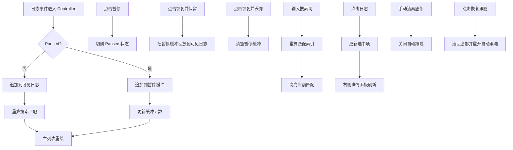

# viewer-controls-and-search design

## 0. 术语约定

| 术语 | 定义 | 防冲突结论 |
| --- | --- | --- |
| 可见日志 | 当前主列表实际渲染的日志集合 | 不等于暂停期间的后台缓冲 |
| 暂停缓冲 | 用户点击暂停后仍持续采集、但暂不展示的日志集合 | 与“清空视图”区分，清空只清可见日志 |
| 当前匹配 | 搜索结果中当前聚焦的那一条 | 用于上下一个跳转和高亮 |
| 自动跟随 | 主列表保持滚到底部；用户手动滚离底部后关闭 | 属于 UI 视图状态，不回写到 adb 或 session 源 |
| 详情面板 | 右侧展示当前选中日志的原始文本和已解析字段 | JSON / StackTrace / source 深解析留给后续 feature |

## 1. 决策与约束

### 需求摘要

- **做什么**：在当前单设备 H5 日志最小闭环上，补齐暂停/恢复、清空视图、复制、基础搜索、自动跟随和右侧详情面板。
- **为谁做**：已经能看到 H5 日志、但需要继续在当前会话里做筛查和定位的开发与测试。
- **成功标准**：
  - 暂停后采集继续，UI 不追加，状态区能看到缓冲计数；
  - 恢复时可选择保留或丢弃暂停期间的缓冲日志；
  - 清空视图只清当前可见日志，不触发 `adb logcat -c`；
  - 搜索框能在当前视图里高亮匹配，并支持上一条 / 下一条跳转；
  - 主列表默认自动跟随底部，手动滚离底部后停止跟随，点击按钮恢复；
  - 点击日志后右侧详情面板展示原始日志、解析字段、message 与复制按钮。
- **明确不做**：
  - 不实现清空设备 logcat buffer；
  - 不实现正则 / 全词 / 大小写敏感 / 错误跳转；
  - 不实现多行选择复制、JSON 复制、堆栈复制、导出；
  - 不实现 WebView source / JSON / StackTrace 深解析；
  - 不实现多 Tab、多窗口、多会话。

### 复杂度档位

走桌面内部工具默认档位，无偏离。

### 关键决策

1. **暂停/恢复放在 controller 层，不回推到底层 logcat 子进程**
   - 这样符合文档“采集继续、UI 暂停追加”的要求，也不需要重启 adb 进程。
2. **基础搜索只覆盖当前可见日志，并以行级高亮 + 上下跳转实现**
   - 当前 feature 目标是快速定位，不在这一步引入正则解析和复杂匹配选项。
3. **复制动作由 UI 发起，controller 只提供当前选中内容**
   - Gio 剪贴板命令需要 `layout.Context`，放在 UI 层更直接。
4. **自动跟随先依赖 Gio List 的 `ScrollToEnd + Position.BeforeEnd`**
   - 这能真实实现“滚离底部后停止跟随”，不用自己维护一套滚动坐标系统。
5. **详情面板只展示当前已经解析出来的信息**
   - 深度结构化解析属于后续 `rich-log-details-and-crash-detection`，这里不抢跑。

## 2. 名词与编排

### 2.1 名词层

#### 现状

- 当前 `app.Model` 只有 `Status`、`Devices` 和字符串数组 `Logs`，不支持暂停缓冲、搜索匹配、选中态和详情展示。来源：[model.go](/E:/github/logcat/internal/app/model.go:1)
- 当前 `Controller.consume` 收到日志后直接追加到列表，没有暂停缓冲或搜索重算逻辑。来源：[controller.go](/E:/github/logcat/internal/app/controller.go:105)
- 当前 `ui.Shell` 只有左侧设备列表和中间日志列表，没有工具栏、搜索输入、跟随开关或详情面板。来源：[shell.go](/E:/github/logcat/internal/ui/shell.go:20)

#### 变化

1. **把 `Logs []string` 升级成带原始 entry 的 `LogViewItem` 集合**
   - 允许主列表渲染和详情面板共用同一份数据。
2. **新增 `SearchState`**
   - 保存当前 query、匹配索引、当前匹配位置。
3. **新增 `PauseState`**
   - 保存 `paused`、后台缓冲条数、丢弃计数。
4. **把选中态显式落到 `SelectedIndex`**
   - 保存当前选中日志索引，供详情面板和复制动作使用，不额外引入独立状态实体。
5. **补齐 controller 操作面**
   - 新增 `Pause`、`ResumeKeep`、`ResumeDiscard`、`ClearVisible`、`SetSearchQuery`、`NextMatch`、`PrevMatch`、`SelectLog`。

#### 接口示例

```go
controller.Pause()
// 之后新日志继续进入暂停缓冲，但 VisibleLogs 不变

controller.ResumeKeep()
// 暂停期间缓冲的日志补进 VisibleLogs，并重算搜索匹配
```

```go
controller.SetSearchQuery("token")
model := controller.Model()
// model.Search.Query == "token"
// model.Search.MatchIndexes 保存当前视图命中的日志行索引
// model.Search.Current 指向当前匹配
```

```go
controller.SelectLog(12)
selected, ok := controller.SelectedLog()
// selected.Entry.Raw / selected.Entry.Message 供详情面板与复制动作使用
```

### 2.2 编排层



#### 现状

- 事件流是 `session.Supervisor -> Controller.consume -> model.Logs -> ui.Shell` 单向直写。来源：[supervisor.go](/E:/github/logcat/internal/session/supervisor.go:36)、[controller.go](/E:/github/logcat/internal/app/controller.go:105)
- UI 当前没有输入控件，也没有对列表滚动位置做任何观察。来源：[shell.go](/E:/github/logcat/internal/ui/shell.go:55)

#### 变化

1. 在 `Controller.consume` 中引入 paused 分支：未暂停时进可见日志，暂停时进后台缓冲。
2. 在 controller 层新增恢复分支：保留恢复会把缓冲回放到可见日志，丢弃恢复则直接清空缓冲。
3. 在每次可见日志变更后重算基础搜索状态，并在 UI 侧高亮命中行。
4. 在 UI 侧新增工具栏和右侧详情面板；列表点击更新选中态，复制按钮直接向 Gio 剪贴板发命令。
5. 在 UI 侧利用 `widget.List.Position.BeforeEnd` 维护自动跟随开关。

#### 流程级约束

- 暂停期间不能丢当前可见日志；新日志只允许进入暂停缓冲。
- `ClearVisible` 只清当前可见日志、当前匹配和选中态，不执行 `adb logcat -c`，搜索框 query 保留给后续新日志继续匹配。
- 搜索必须只作用于当前可见日志；被丢弃的暂停缓冲不应该进入匹配集合。
- 当前匹配与选中项要尽量对齐：跳转到上一条/下一条匹配时同步更新选中项。
- 右侧详情面板不得阻塞主日志采集；它只读取当前选中项快照。

### 2.3 挂载点清单

- `internal/app/controller`：新增暂停/恢复/搜索/清空/选中编排入口
- `internal/ui`：新增工具栏、日志详情面板、复制按钮、跟随按钮
- `cmd/logcatviewer/main.go`：依赖装配不变，仅承载新 UI/Controller 能力的入口

### 2.4 推进策略

1. **微重构：拆开 UI 文件职责**
   - 退出信号：`internal/ui` 按壳、工具栏、日志列表、详情面板拆开，行为不变且测试/构建仍绿
2. **controller 状态骨架**
   - 退出信号：暂停、恢复、清空、搜索、选中等操作可通过纯单测驱动
3. **采集与搜索联动**
   - 退出信号：日志进入时能正确落到可见日志或暂停缓冲，并同步重算搜索匹配
4. **UI 工具栏与详情面板**
   - 退出信号：界面出现暂停/恢复/清空/搜索/复制/详情区，点击会触发正确 controller 行为
5. **自动跟随与收尾验证**
   - 退出信号：手动滚离底部会停止跟随，点击按钮恢复跟随；全量测试与构建通过

### 2.5 结构健康度与微重构

#### 评估

- 文件级 — [shell.go](/E:/github/logcat/internal/ui/shell.go:1)：当前 140 行左右，只承担设备列表和日志列表；本 feature 继续叠加工具栏、搜索输入、详情面板、跟随按钮后会显著膨胀并混入多种 UI 职责。
- 文件级 — [controller.go](/E:/github/logcat/internal/app/controller.go:1)：当前约 160 行，新增暂停/搜索/选中逻辑后仍可通过拆出新文件承载状态相关方法，暂不需要先搬旧代码。
- 目录级 — `internal/ui/`：当前只有 `shell.go` 和 `theme.go`，本 feature 至少还会新增工具栏和详情区域，继续平铺在单文件里会让 UI 结构不可读。

#### 结论：微重构（拆文件）

#### 方案

- 搬什么：把 `shell.go` 里的渲染职责拆成 `shell.go`（事件循环与总布局）、`controls_panel.go`（顶部工具栏）、`log_panel.go`（主列表和高亮）、`detail_panel.go`（右侧详情区）、`devices_panel.go`（左侧设备区）。
- 搬到哪：全部仍在 `internal/ui/` 包下，不改对外 API，不改 `Run` 入口签名。
- 行为不变怎么验证：拆分完成后 `go test ./...` 与 `go build ./cmd/logcatviewer` 继续通过，且 UI 入口仍是 `ui.Run(window, controller)`。
- 步骤序列（provable refactor）：
  1. 把现有 `layoutDevices` / `layoutLogs` 搬到独立文件，保持签名不变。
  2. `shell.go` 只保留壳对象、事件循环和总布局骨架。
  3. 编译与测试确认行为零变更后，再进入本 feature 主体。

## 3. 验收契约

1. **暂停保持采集**
   - 输入 / 触发：日志正在流入时点击暂停
   - 期望可观察结果：主列表停止追加，状态区显示 `Paused` 与缓冲计数
2. **恢复并保留缓冲**
   - 输入 / 触发：暂停期间产生多条新日志后点击“恢复并显示”
   - 期望可观察结果：缓冲日志补进主列表，缓冲计数归零
3. **恢复并丢弃缓冲**
   - 输入 / 触发：暂停期间产生多条新日志后点击“恢复并丢弃”
   - 期望可观察结果：主列表不追加这些缓冲日志，缓冲计数归零
4. **清空视图**
   - 输入 / 触发：当前列表已有日志时点击“清空视图”
   - 期望可观察结果：主列表清空、详情面板重置，不触发设备级清空
5. **基础搜索**
   - 输入 / 触发：搜索框输入普通文本，点击上一条 / 下一条
   - 期望可观察结果：命中行高亮，当前匹配在主列表和详情面板同步切换
6. **自动跟随**
   - 输入 / 触发：日志持续流入时手动滚离底部，再点击“恢复跟随”
   - 期望可观察结果：滚离底部后新日志不强制把视图拉回底部；点击按钮后重新跟随尾部
7. **复制当前日志**
   - 输入 / 触发：选中一条日志后点击复制当前行 / 复制原始日志 / 复制 message
   - 期望可观察结果：对应文本进入系统剪贴板

### 明确不做的反向核对项

- 代码中不应调用 `adb logcat -c`
- 代码中不应出现正则 / 大小写敏感 / 全词匹配配置项
- 代码中不应出现多 Tab、多窗口或多会话状态容器
- 代码中不应出现 JSON / StackTrace / WebView source 深解析逻辑

## 4. 与项目级架构文档的关系

本 feature 验收后，需要把以下内容提炼回 architecture：

- **名词**：`SearchState`、`PauseState`、`SelectedIndex`、`LogViewItem`
- **动词骨架**：日志事件进入后在 visible / paused buffer 间分流，搜索和选中状态跟随可见日志更新
- **流程级约束**：暂停不杀进程、清空只清视图、自动跟随依赖 UI 滚动位置而不是 adb 行为

预计主要更新 [runtime-single-device-logcat-loop.md](/E:/github/logcat/.codestable/architecture/runtime-single-device-logcat-loop.md:1) 和 [ARCHITECTURE.md](/E:/github/logcat/.codestable/architecture/ARCHITECTURE.md:1)。
