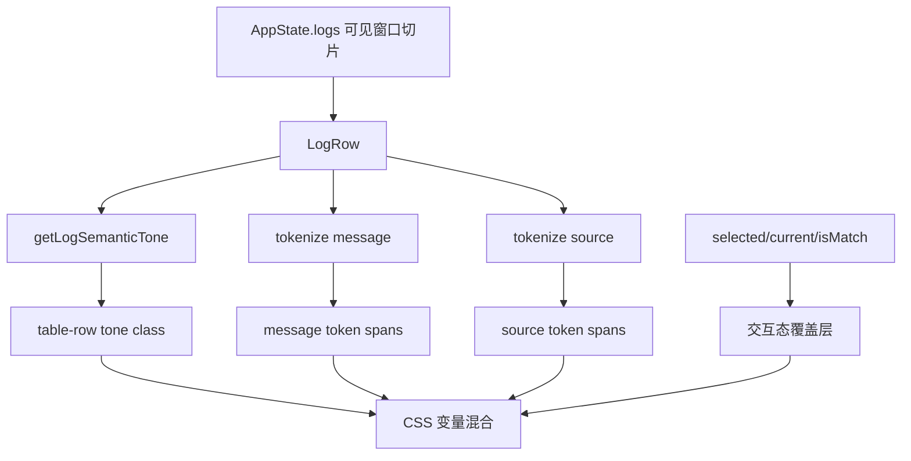

# viewer-log-semantic-highlighting design

## 0. 术语约定

| 术语 | 定义 | 防冲突结论 |
| --- | --- | --- |
| 行语义色 | 一整行根据 level 和内容类型得到的基础色层 | 不等于当前 `selected/current` 选中高亮 |
| 轻量 token | 在 message/source 内做的少量片段着色，如 URL、源码位置、关键词 | 不引入完整富文本解析器 |
| 特殊信息 | URL、文件位置、堆栈 `at` 前缀、HTTP 方法、错误词、数字状态信息等可单独辨识的片段 | 只服务显示，不回写 model |
| 渲染着色器 | 纯前端展示层的轻量分类函数，输入 `LogItemView`，输出 class/token | 当前仓库无同名概念，可安全引入 |

## 1. 决策与约束

### 需求摘要

- **做什么**：把当前日志表格从“按 level 三色 + 纯文本列”升级成更接近 Android Studio 的清晰层次，重点改善时间、tag、message、source、链接与特殊词的可读性。
- **为谁做**：长时间盯着密集日志流、需要快速扫出错误、请求、链接、堆栈和源码位置的调试者。
- **成功标准**：
  - 不同 level 的整行观感更稳定，信息密度高时仍能快速分辨严重程度；
  - message/source 里的 URL、源码位置、堆栈前缀、HTTP 方法、错误/警告关键词、数字状态信息能形成稳定色差；
  - 搜索命中、当前选中和当前匹配继续可见，不被新配色淹没；
  - 大量日志滚动时不出现明显卡顿，不破坏现有虚拟滚动；
  - 实现只发生在前端展示层，不改后端采集、过滤、搜索和导出语义。
- **明确不做**：
  - 不新增后端字段，不让 Go 侧预先拆 token；
  - 不做逐字符语法高亮、ANSI 解析、Markdown/HTML 渲染；
  - 不把普通 URL 变成真实可点击导航行为；
  - 不做完整 crash/JSON/source 结构化识别；那属于后续 `rich-log-details-and-crash-detection`；
  - 不引入每次渲染都遍历全量日志的全局二次扫描或缓存层。

### 复杂度档位

走桌面内部工具默认档位，无偏离。

### 关键决策

1. **颜色增强只落在虚拟列表的可见行**
   - 当前 `LogTable` 已按 `scrollTop + viewportHeight` 做窗口切片；新着色逻辑只作用于 `logs.slice(start, end)` 这一小段，不能对全量 `state.logs` 预渲染 token。
2. **先做“整行语义色 + 少量 token”，不做重解析**
   - Android Studio 的舒服感主要来自层次清楚，不必靠昂贵的逐字符分析复刻。
3. **token 规则以正则白名单驱动，但单行只做一次线性扫描**
   - 每行 message/source 最多走一遍 `tokenizeLogText`，按固定顺序切出少量 token；不做嵌套回溯，不跑多轮 replace。
4. **搜索命中高亮保持最高优先级**
   - 新配色是底层语义色，`selected/current/isMatch` 仍是交互态；交互态必须压过语义色。
5. **样式变量集中管理，避免散落硬编码**
   - 所有新颜色进入 `:root` 变量区，表格样式只消费 token 类，避免后续继续膨胀单个选择器。

## 2. 名词与编排

### 2.1 名词层

#### 现状

- 当前 `LogRow` 只根据 `log.level` 推导 `info/warn/error` 三类 tone，并把 `message`、`tag`、`source` 当纯文本渲染。来源：[app-shell.tsx](/E:/github/logcat/frontend/src/app-shell.tsx:303)
- 当前表格可见性能来自前端虚拟滚动：仅渲染 `logs.slice(start, end)`，行高固定，靠上下 spacer 保持滚动高度。来源：[app-shell.tsx](/E:/github/logcat/frontend/src/app-shell.tsx:155)
- 当前样式只有整行左侧色条、level chip 和少量列文本色，没有 message/source 内部语义分层。来源：[style.css](/E:/github/logcat/frontend/src/style.css:523)
- 当前 `LogItemView` 只有原始展示字段 `timeText/level/tag/message/source/raw/display`，没有 token 或 rich spans。来源：[models.ts](/E:/github/logcat/frontend/wailsjs/go/models.ts:29)

#### 变化

1. **新增前端展示态 `LogTextToken`**
   - 只存在于 React 渲染路径，描述一段文本及其语义类型，如 `plain/url/source/http/error-keyword/stack-frame/dim`。
2. **新增 `tokenizeLogText(text, kind)`**
   - 针对 `message` 和 `source` 返回 token 列表；`kind` 用于区分 message/source 的规则强弱。
3. **新增 `getLogSemanticTone(log)`**
   - 在 `info/warn/error` 基础上细分出 `request/stack/success/noise` 等视觉倾向，但仍受 level 上限约束。
4. **把 message/source 从纯字符串 span 升级为 token span 列表**
   - 保持文本内容不变，只改变 `<span>` 包装与类名。
5. **新增样式变量组**
   - 包括行背景层、弱文本、链接、源码位置、堆栈、HTTP 方法、成功词、错误词、数值信息等变量。

#### 接口示例

```ts
const tone = getLogSemanticTone(log);
// "error" | "warn" | "request" | "stack" | "success" | "info"
```

```ts
const tokens = tokenizeLogText(
  "[H5] 网络错误: 请求超时 POST /api/apply/submit (30s)",
  "message",
);
// [
//   { text: "[H5] ", kind: "badge" },
//   { text: "网络错误", kind: "error-keyword" },
//   { text: "POST", kind: "http-method" },
//   { text: "/api/apply/submit", kind: "path" },
//   { text: "30s", kind: "metric" },
// ]
```

### 2.2 编排层



#### 现状

- `LogTable` 每次渲染只负责切片与行列表；单行内部逻辑很薄。来源：[app-shell.tsx](/E:/github/logcat/frontend/src/app-shell.tsx:155)
- `handleScroll` 和 `autoFollow` 已经是当前主要滚动交互，不能被额外渲染成本拖慢。来源：[use-app-controller.ts](/E:/github/logcat/frontend/src/use-app-controller.ts:109)
- 搜索/选中状态已经通过 `log.isCurrent/isSelected` 控制类名。来源：[app-shell.tsx](/E:/github/logcat/frontend/src/app-shell.tsx:307)

#### 变化

1. 在 `LogRow` 渲染前先算 `tone`，再分别 token 化 `message` 与 `source`。
2. `LogRow` 只消费本行数据，不依赖全局日志上下文，不额外维护缓存 map。
3. `LogTable` 的虚拟滚动切片方式保持不变，行高保持常数，不因为 token span 数量变化引入自动换行。
4. `selected/current/isMatch` 继续由现有类名控制，新语义色只作为底色和局部文本色。
5. detail panel 暂不做 token 化；它继续渲染原始文本，避免一次 feature 同时改两种阅读模型。

#### 流程级约束

- **只对可见行做工作**：不能在 `useAppController` 中对整个 `state.logs` 做 `map(tokenize)`。
- **固定行高**：token span 不能引入多行换行、动态高度或 inline block 抖动。
- **匹配规则弱侵入**：识别不到的文本必须原样落回 `plain`，不许吞字或改字。
- **交互态优先级最高**：选中、当前匹配、搜索命中必须继续比语义着色更醒目。
- **样式与逻辑解耦**：类型判断在 TS，颜色取值在 CSS 变量，不把视觉值硬编码进渲染函数。

### 2.3 挂载点清单

- `frontend/src/app-shell.tsx`：`LogRow` 渲染结构从纯文本升级为 token spans，并提取轻量展示函数
- `frontend/src/style.css`：日志表格颜色变量、token 类、交互态层级与 hover/selected/current 组合样式
- `frontend/src/mock-state.ts`：补几条更接近真实 Android Studio 观感的日志样例，覆盖 URL/堆栈/源码位置信息

### 2.4 推进策略

1. **提取展示层 helper**
   - 退出信号：`app-shell.tsx` 不再把所有着色判断塞进 `LogRow` 一个函数，token/tone helper 可独立测试
2. **接入行语义色与 token 渲染**
   - 退出信号：message/source 能按规则生成 spans，整行 tone 与 token 色同时可见
3. **补样式变量与交互覆盖**
   - 退出信号：selected/current/isMatch 与新配色组合后仍清晰，不出现对比度塌陷
4. **补预览样例与收尾验证**
   - 退出信号：mock 数据能覆盖主要 token 场景，前端构建通过

### 2.5 结构健康度与微重构

#### 评估

- 文件级 — [app-shell.tsx](/E:/github/logcat/frontend/src/app-shell.tsx:1)：当前已 315 行，超过项目硬指标；继续往 `LogRow` 里直接塞 token 规则会进一步恶化。
- 文件级 — [style.css](/E:/github/logcat/frontend/src/style.css:1)：当前 685 行，已经显著偏胖；新日志着色如果继续平铺在原文件底部，可维护性会继续下降。
- 目录级 — `frontend/src/`：当前日志壳、控制器、选择器都平铺，适合新增一个日志展示专责文件，而不是继续把展示逻辑堆在 `app-shell.tsx`。

#### 结论：微重构（拆文件）

#### 方案

- 搬什么：把 `LogRow`、token helper、tone helper、必要的 token 类型提到新的 `frontend/src/log-row.tsx` 或同职责文件；`app-shell.tsx` 只保留布局组件拼装。
- 搬到哪：仍在 `frontend/src/` 下，不改 `App` 和 `useAppController` 对外接口。
- 行为不变怎么验证：拆分前后 `npm run build` 通过，`LogTable` 的 props 和虚拟滚动逻辑不变。
- 步骤序列：
  1. 先提取 `LogRow` 与 helper 到独立文件，导出给 `app-shell.tsx` 使用；
  2. 保持现有渲染结果不变完成一次构建验证；
  3. 再在新文件里增加语义着色逻辑。

## 3. 验收契约

1. **错误/警告层次清晰**
   - 输入 / 触发：列表同时出现 `I/W/E` 混合日志
   - 期望可观察结果：错误与警告行在大段日志中能明显跳出，但未破坏整体暗色稳定度
2. **message 内特殊信息分层**
   - 输入 / 触发：出现 HTTP 方法、URL/路径、错误关键词、耗时/次数等文本
   - 期望可观察结果：这些片段与普通正文有稳定色差，仍保持单行展示
3. **source/堆栈信息更易扫读**
   - 输入 / 触发：出现 `views/apply/index.vue:57` 或 `at computed (...)`
   - 期望可观察结果：源码位置、堆栈前缀与普通 message 可区分，接近 IDE 日志的扫读体验
4. **交互态不被淹没**
   - 输入 / 触发：选中某条日志，再让其同时成为搜索当前匹配
   - 期望可观察结果：selected/current 仍比语义色更明显
5. **性能边界守住**
   - 输入 / 触发：使用现有虚拟列表滚动大量日志
   - 期望可观察结果：实现没有改动虚拟切片逻辑，也没有在 controller/useAppController 对全量日志做 token 预处理

### 明确不做的反向核对项

- 代码中不应出现对 `state.logs` 全量 `map(tokenize...)` 的预计算
- 代码中不应出现后端新增 token 字段或 Wails 模型变更
- 代码中不应出现真实超链接点击导航或外部打开浏览器动作
- 代码中不应出现逐字符高亮、ANSI 解析器、Markdown/HTML 注入渲染

## 4. 与项目级架构文档的关系

本 feature 如果验收通过，需要把以下内容提炼回 requirement/architecture：

- requirement：当前能力边界可补一句“日志阅读层支持语义着色与特殊信息高亮”
- architecture：前端日志表格新增“展示层语义着色器”，但它仍是纯 UI 计算，不回写会话/过滤状态

预计主要更新 [h5-logcat-viewing.md](/E:/github/logcat/.codestable/requirements/h5-logcat-viewing.md:1) 和 [ARCHITECTURE.md](/E:/github/logcat/.codestable/architecture/ARCHITECTURE.md:1)。
