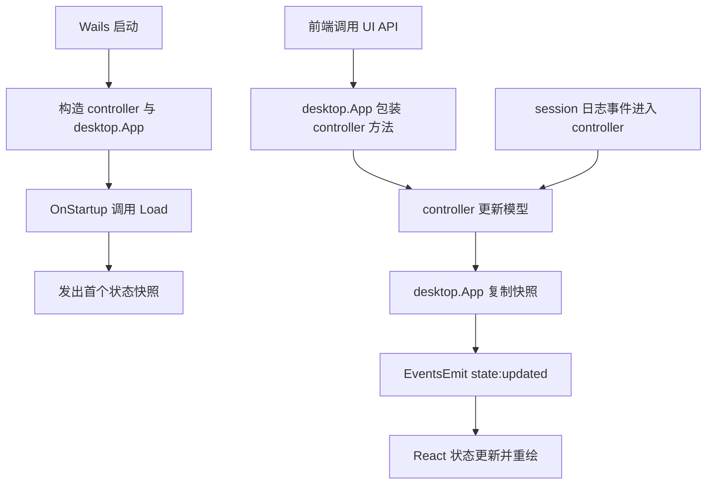

# wails-v2-figma-shell design

## 0. 术语约定

| 术语 | 定义 | 防冲突结论 |
| --- | --- | --- |
| Wails 壳 | Wails v2 的 Go 主进程、窗口配置、事件桥与 JS 绑定层 | 替代现有 Gio `internal/ui` |
| 前端快照 | 从 controller 复制出的只读状态 JSON | 不直接暴露 controller 内部 slice |
| UI API | 暴露给前端的 Go 方法集合 | 只包装现有 controller 行为，不改业务规则 |
| 状态推送 | 后端通过 Wails 事件向前端广播最新快照 | 不依赖前端轮询 |

## 1. 决策与约束

### 需求摘要

- **做什么**：移除当前 Gio UI，改为 Wails v2 桌面应用，并按 Figma `12:4` 的布局、色彩与信息层级重建主界面。
- **为谁做**：需要桌面端查看 H5/Android 日志、且希望界面与设计稿一致的当前使用者。
- **成功标准**：
  - 仓库入口改为 Wails v2，可本地构建与运行；
  - Gio `internal/ui` 和 Gio 依赖不再参与主程序；
  - 前端界面结构与 Figma 主体一致：顶部工具栏、过滤栏、日志表、右侧详情面板、底部状态栏；
  - 前端可驱动现有 controller 的设备选择、包选择、过滤、暂停恢复、清空、保存过滤器、日志选择、导出；
  - 后端日志流变化会推送到前端并刷新界面。
- **明确不做**：
  - 不保留 Gio UI 兼容入口；
  - 不在这次顺手实现 roadmap 里未完成的新能力；
  - 不做 Figma 未提供的额外窗口、拖拽布局或多标签。

### 复杂度档位

走默认桌面工具档位。唯一偏离是 UI 技术栈从 Gio 改为 Wails + React，但业务核心不重写。

### 关键决策

1. **业务层保留 `internal/app` / `internal/adb` / `internal/session`**
   - 只替换桌面壳，不重做日志采集与过滤核心，降低迁移风险。
2. **Wails 前端通过事件订阅获取状态，而不是频繁轮询**
   - 现有日志流是持续增量更新，事件推送更接近 Gio 当前“持续重绘”模型。
3. **补一层只读快照 DTO**
   - 避免把 controller 内部 slice 直接暴露给前端导致共享引用和并发读写问题。
4. **移除 `internal/ui` 整包与 Gio 依赖**
   - 用户已明确“之前的完全不要了”，因此不保留双壳并存。
5. **前端直接按 Figma 建视觉，不引入第三方组件库**
   - 设计稿结构简单，手写更可控，也避免被组件库样式牵着走。

## 2. 名词与编排

### 2.1 名词层

#### 现状

- 程序入口是 [main.go](/E:/github/logcat/cmd/logcatviewer/main.go:1) 中的 Gio 窗口初始化，随后调用 `ui.Run(window, controller)`。
- `internal/app.Controller` 已承载设备加载、会话启动、包名/进程选择、过滤、暂停、搜索和日志选择等核心行为。
- `internal/ui` 持有 Gio 组件状态和布局逻辑，是当前唯一 UI 壳。

#### 变化

1. **新增 `desktop.App` 级 Wails 绑定对象**
   - 负责启动时加载 controller、保存上下文、广播状态、暴露前端调用方法。
2. **新增前端快照 DTO**
   - 例如 `AppState`、`LogItemView`、`SelectedLogView`，字段只覆盖前端渲染所需内容。
3. **新增后端事件名常量**
   - 用于统一状态推送通道，例如 `state:updated`。
4. **新增前端状态模型**
   - `useAppState` 维护后端快照、加载态、错误态和本地输入态。

#### 接口示例

```go
app.GetState() AppState
app.SelectDevice("emulator-5554")
app.ApplyFilterDraft()
```

```ts
EventsOn("state:updated", (state) => {
  setState(state as AppState)
})
```

### 2.2 编排层



#### 现状

- 入口层自己 `new gioapp.Window`，并依赖 250ms 刷新 ticker 让 UI 拉取 controller 状态。
- 业务状态变更后没有统一“通知 UI”的接口，Gio 是通过持续 `Invalidate()` 被动看到最新 model。

#### 变化

1. 用 Wails `OnStartup` 代替 Gio `bootstrap`。
2. 在 `Controller` 内补一个可注册的状态变更回调，每次 model 变动后通知桌面壳。
3. `desktop.App` 收到通知后复制出前端快照，通过 `runtime.EventsEmit` 推给前端。
4. React 前端订阅事件并重绘，不再维护 Gio 那套 widget 状态。
5. 前端交互动作统一调用 Go 绑定层方法；方法执行后由同一套状态推送刷新界面。

#### 流程级约束

- 状态推送必须在 controller 变更后发生，前端不能自己猜测业务状态。
- Wails 绑定层不得修改业务规则，只做参数转换、错误上抛、状态广播。
- 前端选择日志后，详情面板只展示后端快照里的当前选中项。
- 导出、保存过滤器、切换设备等失败必须显式返回错误，不吞错。

### 2.3 挂载点清单

- `cmd/logcatviewer/main.go`：切换到 Wails v2 启动入口
- `internal/app`：增加状态通知与前端快照复制能力
- `internal/desktop`：新增 Wails 绑定层
- `frontend/`：新增 React + Vite 前端并按 Figma 重建 UI
- `go.mod` / `wails.json`：替换 Gio 依赖与构建配置

### 2.4 推进策略

1. **桌面壳替换骨架**
   - 退出信号：Wails 入口、配置、前端目录落地，Gio 不再是主入口
2. **controller 通知与快照层**
   - 退出信号：后端能在状态变化后广播前端快照
3. **Go 绑定层**
   - 退出信号：前端所需核心动作都有对应方法并能回推状态
4. **Figma 前端界面**
   - 退出信号：UI 结构、配色、排版和分栏对齐设计稿
5. **构建验证与清理**
   - 退出信号：`go test ./...`、前端构建、`wails build` 可通过，Gio 遗留依赖已移除

### 2.5 结构健康度与微重构

#### 评估

- 文件级：当前 [cmd/logcatviewer/main.go](/E:/github/logcat/cmd/logcatviewer/main.go:1) 很小，适合作为纯入口保留。
- 文件级：`internal/ui/` 全部是 Gio 壳逻辑，本次要求是彻底替换，不应继续保留。
- 目录级：仓库目前没有 `frontend/` 与 Wails 相关目录，适合直接按 Wails 标准骨架新增。

#### 结论：不做“只搬不改行为”微重构，直接替换壳层

- 原因：这次不是在 Gio 壳上加能力，而是整体技术栈替换。保留旧 UI 再拆迁只会增加混合状态。

## 3. 验收契约

1. **Wails 入口启动**
   - 触发：执行构建/运行命令
   - 期望：程序通过 Wails 启动窗口，不再依赖 Gio `app.Main()`
2. **首屏状态加载**
   - 触发：应用启动
   - 期望：能自动加载 adb/设备状态，并把首个快照推给前端
3. **设备与过滤交互**
   - 触发：前端切换设备、包名、过滤器、过滤草稿
   - 期望：controller 执行对应动作，前端收到刷新后的状态
4. **实时日志刷新**
   - 触发：logcat 持续产生新日志
   - 期望：前端表格和状态栏随推送更新
5. **详情面板**
   - 触发：点击任意日志行
   - 期望：右侧详情面板展示该条日志的时间、级别、标签、来源、原始内容
6. **显式失败**
   - 触发：adb 不存在、设备未选择、过滤条件非法等
   - 期望：错误以返回值或状态文本形式暴露，前端不伪造成功

### 明确不做的反向核对项

- 仓库中不再存在 Gio 作为主程序依赖
- 不保留“旧 UI 回退入口”
- 不新增与 Figma 无关的扩展视图或功能开关

## 4. 与项目级架构文档的关系

本 feature 验收后需要回填 architecture：

- `desktop-shell` 的实现从 Gio 更新为 Wails v2 + React
- 增加“controller 状态通知 -> 桌面壳事件桥 -> 前端快照”这条现状链路
